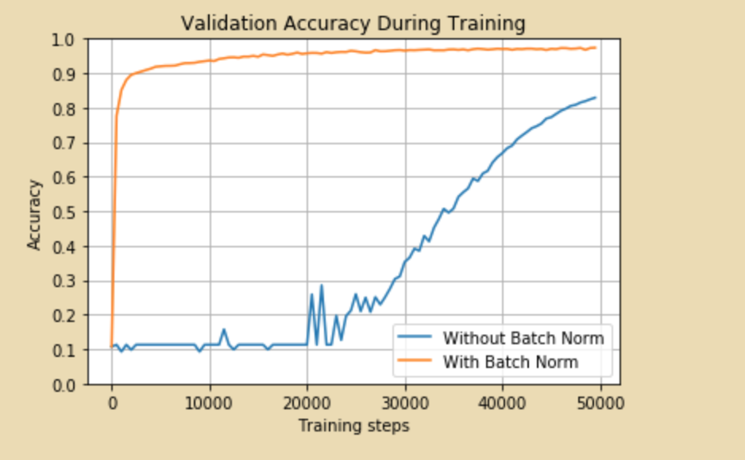

Today, I encountered an intriguing graph.

Look at that graph, we see that at the first 20000 iterations, we see no hope in our training, it looks like that the training process is stuck. If it were me who had to do this training, I would have abandoned training this model at the first 2000 iterations and judged that the model was not good enough or my training choice was bad. Nevertheless, it turns out that it's not the case here.

So the first thing I learned form this is that it would be good reminder for anyone who is impatient in training. It takes time any many random steps (yes, with 'luck') that our model can reach a good region.

The second thing it shows is related to the comparison between 2 curves in the graph. That's training deep neural works faces the *internal covariate shift*. Yet, it's not so relevant to what I want to show.
